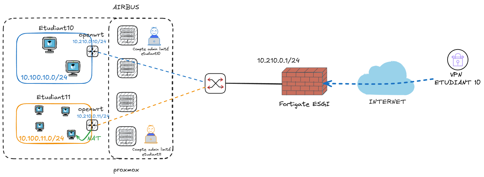

# labomatics

CLI Python pour déployer automatiquement des environnements de lab réseau
sur un cluster Proxmox à partir d'un CSV d'étudiants.

```bash
pip install labomatics
labomatics init    # initialise /etc/labomatics/
labomatics apply   # synchronise Proxmox avec le CSV
```

---

## Fonctionnalités

- **Déploiement piloté par CSV** — ajouter un étudiant dans `students.csv` suffit pour lui provisionner une VM, un VNet et un compte Proxmox
- **Allocation IP dynamique** — WAN et VXLAN alloués depuis Proxmox, sans fichier d'état local
- **Flavors** — profils de ressources (CPU / RAM / disque) assignés par étudiant
- **Daemon de quota** (`labomatics-quotad`) — stoppe la VM la plus gourmande si le quota est dépassé
- **Build de template OpenWrt** — téléchargement, configuration (SSH, NAT, cloud-init) et conversion en template Proxmox
- **Build de templates custom** — pipeline Packer → provisioning SSH/guest-agent → conversion template
- **Isolation complète** — chaque étudiant est cantonné à son pool et son VNet VXLAN dédié

---

## Par où commencer ?

- **Administrateurs Proxmox** → [Installation et configuration](admin/setup.md)
- **Étudiants** → [Démarrage rapide OpenWrt](openwrt/base.md)

---

## Architecture



Le cluster Proxmox est composé de plusieurs nœuds partageant un stockage commun (LUN iSCSI ou ZFS partagé). Un Fortigate assure le NAT et fournit l'accès Internet au réseau WAN du lab.

Chaque étudiant dispose de :

- une **VM OpenWrt** jouant le rôle de routeur, avec une IP WAN unique
- un **VNet VXLAN dédié** (réseau LAN privé) pour y connecter ses propres VMs
- un **compte Proxmox** limité à son pool personnel

`labomatics apply` provisionne l'ensemble de ces ressources automatiquement depuis le CSV.
